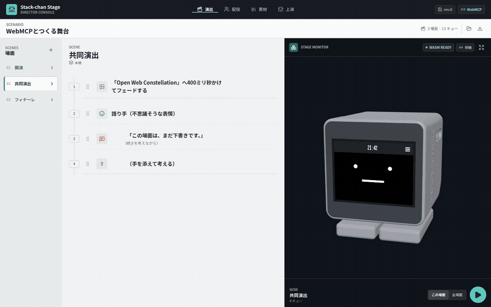

# Stack-chan Stage

> **Co-direct a robot performance with an AI—through the page, not around it.**

Stack-chan Stage is a browser-native director console where a human and an AI
share one visible, revisioned workspace for robot theatre. The page exposes 15
structured WebMCP tools for reading, editing, validating, previewing, and
playing the same scenario shown in the UI. Everything stays visible.

[Launch the live demo](https://meganetaaan.github.io/stack-chan-stage/) ·
[View the source](https://github.com/meganetaaan/stack-chan-stage) ·
[Asset provenance](ATTRIBUTION.md) · [Apache-2.0 license](LICENSE)



## WebMCP contest demo

### Why WebMCP

An agent that only sees pixels has to guess which control changes a cue, how
scene order is represented, and whether an edit is valid. Stack-chan Stage
instead publishes the page's real domain operations through WebMCP. Tool calls
use typed inputs and optimistic revisions, then write back to the same timeline
the human is watching. The human can inspect every change and approve a bounded
preview before the agent starts the full performance.

The default demo contains 3 scenes, 13 cues, 3 original backdrops, and a
procedurally generated BGM loop. Its 90-second hero flow is:

1. Read the workspace and current revision.
2. Revise the dialogue, direction, expression, motion, and backdrop.
3. Validate the complete scenario.
4. Preview only the edited cue range.
5. Wait for human confirmation.
6. Play all scenes.

### Try the hero flow

Open the [live demo](https://meganetaaan.github.io/stack-chan-stage/) in a fresh
or private browser window, wait for `WASM READY`, and click the page once to
unlock audio. Connect a WebMCP-capable browser agent. For local testing in
Chrome 149 or later, enable `chrome://flags/#enable-webmcp-testing` and relaunch
Chrome as described in the
[official Chrome WebMCP guide](https://developer.chrome.com/docs/ai/webmcp).

Send these prompts in order:

```text
Read the current Stage workspace. In scene-collaboration, update the backdrop to Human-Agent Revision Loop with a slide from the left over 650 ms; set narrator to HAPPY; replace the speech with「WebMCPなら、AIがページの構造を読み、人と同じ舞台へ演出を書き戻せます。」; set its direction to「発見を観客と分かち合うように」; and change the motion to clap. Use expectedRevision correctly after every mutation. Do not preview or play yet.
```

```text
Validate the current scenario. Preview only scene-collaboration from cue-collaboration-backdrop through cue-collaboration-motion with audible speech. When the preview ends, summarize any warnings and ask for my confirmation. Do not start the full performance.
```

After reviewing the preview, reply:

```text
Looks good. Play all scenes with audible speech, then report the final run status.
```

### Known limitations

- IndexedDB keeps the last project in that browser profile, so use a fresh or
  private window to reproduce the default demo.
- Browser speech voices and quality vary by operating system. A pointer or key
  gesture is required before BGM can start.
- Runtime execution currently supports one sequential lane per scene.
- The hosted demo runs the in-browser WASM simulator. A physical Stack-chan
  needs the local gateway and an Opus TTS endpoint; physical motion and speaker
  output are not exercised by automated tests.
- WebMCP remains an experimental browser feature, so agent integration depends
  on the browser build and flags in use.

The [Devpost submission draft](docs/submission.md) and
[2:35 demo video script](docs/demo-video-script.md) follow this same flow.

## プロジェクト概要

Stack-chan Stageは、複数の役と場面を編集し、ブラウザ内のｽﾀｯｸﾁｬﾝまたは実機へ上演する演出コンソールです。

ScenarioとCastから実行時のRunPlanを確定し、Cueの完了イベントを待って次のCueへ進みます。
音声は有界のRolling prefetchで準備し、ブラウザではWeb Speech API、実機ではOpusストリームを使用します。

## 実装範囲

- Scene、Role、Cue、Cast、素材をブラウザで編集できます。
- Scene単位または全場面を、1 Laneの直列Runとして上演できます。
- WASM Actorは、固定したstack-chan SimulatorとStage MODをブラウザ内で実行します。
- モーションプリセットから、うなずき、首かしげ、見回しなどの汎用的な身振りと、拍手、考え中のhandスプライト表現を上演できます。
- 実機Actorは、Local GatewayのControl経路とMedia経路を分離して接続します。
- WebMCPは、取得、検証、Scene/Cue編集、素材取込、Cast変更、Preview、Play、Stopの15ツールを登録します。
- Scenario、Cast、素材、生成音声をIndexedDBへ保存します。
- 演出、配役、素材本体を`.stackchan-stage.zip`として書き出し、別のブラウザへ読み込めます。

## 構成

| 層                     | 責務                                              |
| ---------------------- | ------------------------------------------------- |
| `packages/domain`      | Schema、Cast解決、Run compile、Runtime reducer    |
| `packages/application` | Workspace command、音声先読み、effect実行         |
| `packages/adapters`    | WASM、実機、Browser Stage、TTS、IndexedDB、WebMCP |
| `apps/web`             | 演出、配役、素材、上演のUI                        |
| `apps/gateway`         | Browserと実機のWebSocket中継、認証、backpressure  |
| `firmware`             | WASM/実機で共有するStage MODと実機音声受信        |

外部入力は各adapterの境界でZod Schemaへ通します。
対象は保存データ、WebMCP入力、Gateway protocol、TTS応答、Host.Stageイベント、音声provider dataです。
検証Schemaは、Standard Schemaの`~standard`契約に対応するZod 4へ統一しています。

## 必要な環境

- Node.js 22以上
- npm 10以上
- Chromium（E2Eテストを実行する場合）

通常の開発とWASM上演には、Moddable SDKやEmscriptenは不要です。
固定済みのSimulator runtimeとStage MODをリポジトリに含めています。

## 起動

```console
npm ci
npm run dev
```

Web UIは`http://127.0.0.1:5173/`、Local Gatewayは`ws://127.0.0.1:8787`で起動します。
WASM Actorだけを使う場合、Gatewayの接続設定は不要です。

`main`へのpush後は、GitHub Pages workflowが
`https://meganetaaan.github.io/stack-chan-stage/`へWeb UIを公開します。
初回だけRepository SettingsのPagesでSourceを「GitHub Actions」に設定してください。

Gatewayは起動時に一時pairing tokenを表示します。
実機を使う場合は、そのtokenをUIの「配役」から開くLocal Gateway設定へ入力します。

## 検証

```console
npm run check
npx playwright install chromium
npm run test:e2e
```

`npm run check`はformat、型、unit/property/contract/integration testを実行します。
あわせて、Simulator assetとデモ素材のハッシュ、production buildを検査します。
E2EはChromium上で、WASM起動から終演までの基本動作とモバイル表示を確認します。
WebMCPのE2Eでは、workspace取得、共同演出の推敲、検証、Cue範囲のPreview、人の確認、全場面のPlayまでを通します。
プロジェクトファイルのE2Eでは、演出・配役・素材を書き出した後に現在の内容を変更し、ZIPから同じ状態へ復元できることを確認します。

## Local Gatewayと実機

Gatewayを単独で起動する場合は、固定tokenを環境変数へ設定できます。

```console
STAGE_GATEWAY_HOST=0.0.0.0 \
STAGE_GATEWAY_PORT=8787 \
STAGE_GATEWAY_TOKEN='replace-with-a-long-random-token' \
npm run dev --workspace=@stackchan-stage/gateway
```

実機用MODは、Moddable SDK 9.0.0と対象stack-chan hostに合わせてビルドします。
次の例では、設定値を`mod/config`へ埋め込みます。

```console
mcrun -m -p esp32/m5stackchan_cores3 -t build \
  firmware/mods/stackchan-stage-client/manifest.json \
  gatewayUrl='ws://192.168.1.10:8787' \
  token='replace-with-the-gateway-token' \
  sessionId='stage' \
  actorId='stage-left' \
  actorName='舞台上手'
```

生成したXSAはstack-chanのMOD managerから実機へインストールします。
tokenはXSAへ格納されるため、第三者へ配布するarchiveには本番tokenを入れないでください。

実機はOpus 24 kHz、mono、20 ms frameを受信し、再生終了後に`cue.completed`を返します。
Gatewayはpacket creditを超えた送信、64 KiBを超えるmessage、不正Schema、session/Actor不一致を拒否します。

## TTS

TTS endpointを指定しない場合、ブラウザのSpeech Synthesisを使います。
`voiceId: "default"`は上演前に指定localeへ合う実在音声へ解決します。明示した音声が存在しない場合はブラウザ既定へ暗黙に切り替えず、`voiceschanged`を待ったうえで準備エラーとして報告します。生成済みcacheも現在の音声一覧に対して再検証します。
通常の連続発話に`cancel()`、固定待機、失敗時の自動再試行は挟みません。
実機SpeechにはOpus packetが必要なため、UIのLocal Gateway設定へOpus生成endpointを入力します。
認証付きendpointではtokenをOpus TTS tokenへ入力します。tokenはBearer headerで送信し、URLやrequest bodyには含めません。
endpoint応答はformat、packet数、packetサイズ、base64をSchemaで検証してからcacheへ保存します。
Speech Synthesisを提供しない埋込みブラウザでは、WebMCPの`stage.performance.preview`へ`speechMode: "skip"`を明示するとセリフを除外した視覚試演ができます。
この場合は成功結果に`warnings`と`skippedCueIds`が含まれ、音声を再生したものとは扱いません。

## Simulator成果物の再生成

通常の開発では再生成しません。
Stage MODを変更した場合だけ、次を実行します。

```console
MODDABLE=/path/to/moddable npm run build:stage-mod
```

WASM native hostを変更した場合は、固定したstack-chan checkout、Moddable SDK、Emscripten、fontbmを用意して次を実行します。

```console
MODDABLE=/path/to/moddable \
STACKCHAN_STAGE_UPSTREAM=/path/to/stack-chan \
EMSDK=/path/to/emsdk \
npm run build:stage-wasm-host
```

要求する版と成果物のSHA-256は[`vendor/stack-chan-simulator/UPSTREAM.md`](vendor/stack-chan-simulator/UPSTREAM.md)に記録しています。

## 現在の制約

- Runtimeは1 Laneを直列実行します。
- ブラウザ既定TTSは音声データを生成しないため、実機上演にはOpus生成endpointが必要です。
- このリポジトリの自動テストは実機への書込み、サーボ動作、実スピーカー再生を実行しません。

設計の背景とMVP条件は[`stack-chan-stage-overview-design.md`](stack-chan-stage-overview-design.md)を参照してください。

## ライセンス

本プロジェクトの独自コードは[Apache License 2.0](LICENSE)で公開しています。
デモ用の背景とBGMの制作方法、変換内容、ライセンスは[`ATTRIBUTION.md`](ATTRIBUTION.md)に記載しています。
第三者成果物の出典とライセンスは[`THIRD_PARTY_NOTICES.md`](THIRD_PARTY_NOTICES.md)に記載しています。
