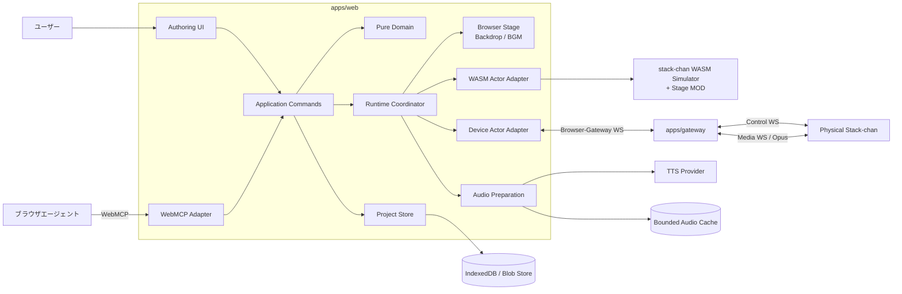
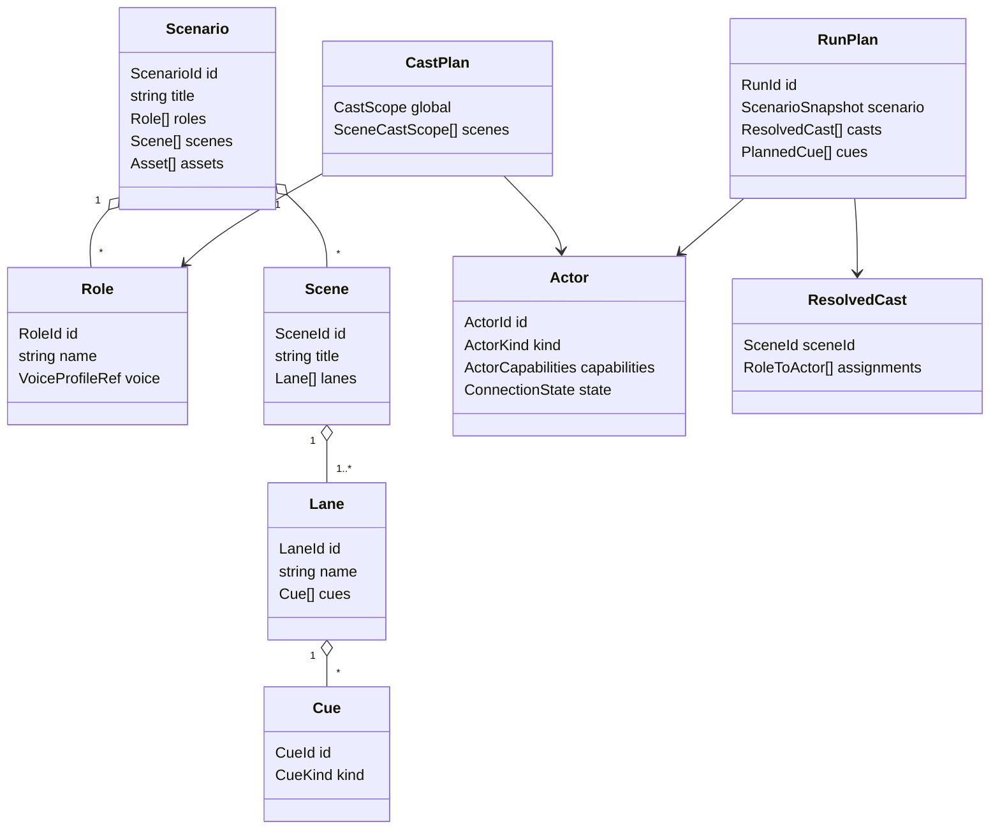
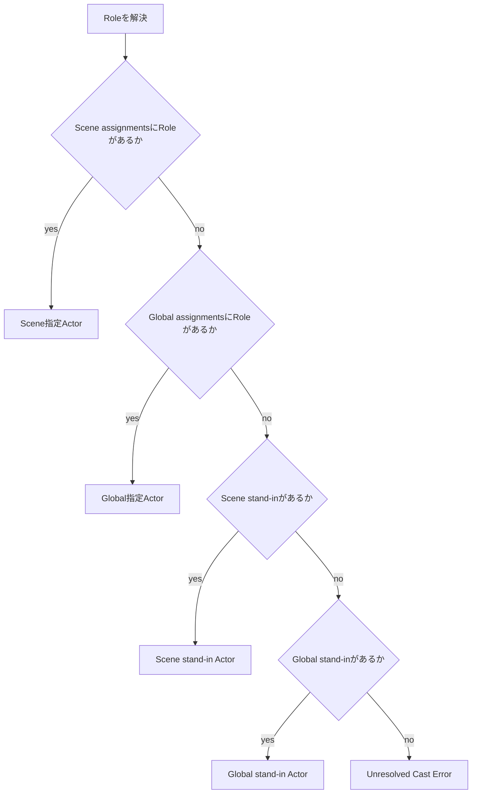
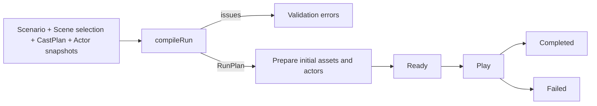
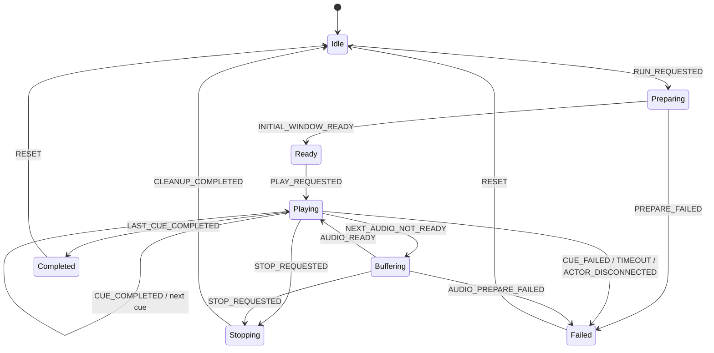
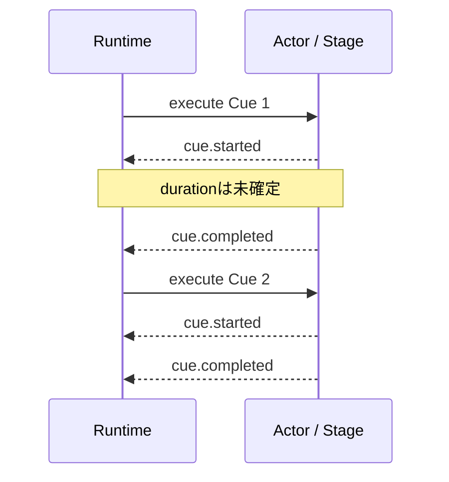
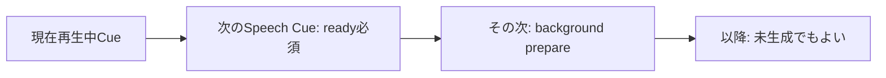
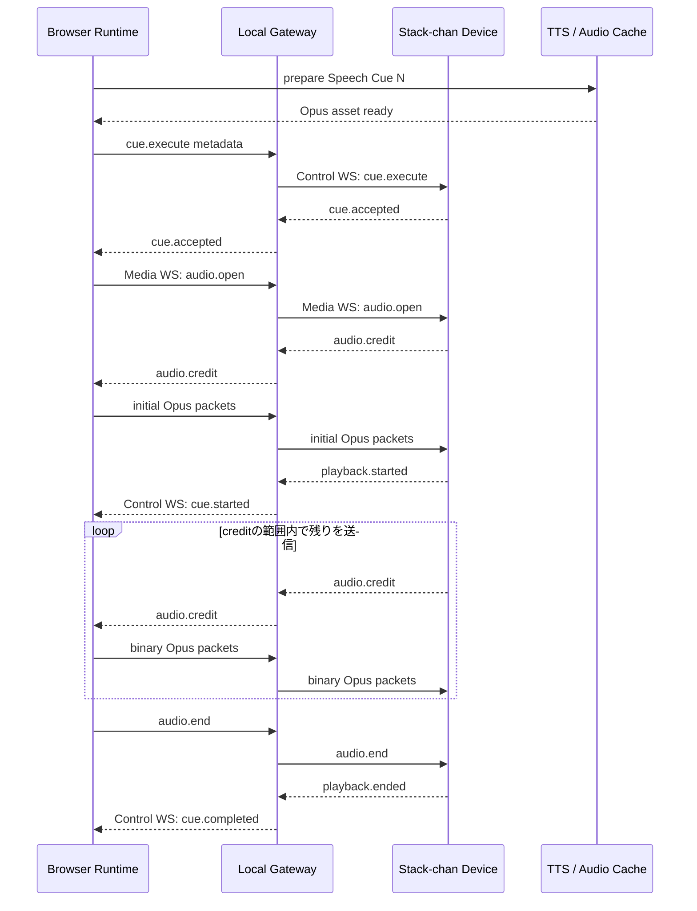
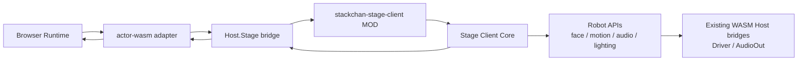
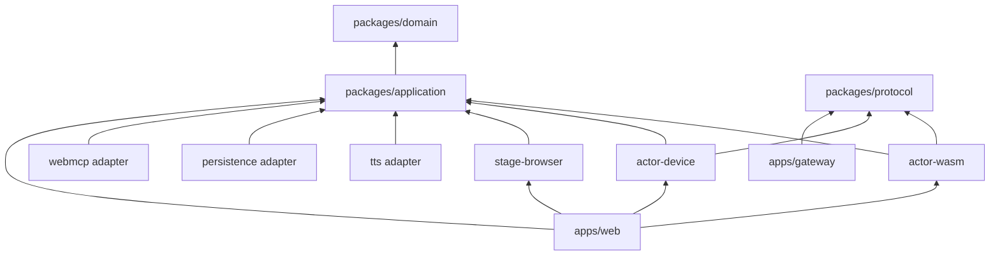

# Stack-chan Stage 概要設計書

- 文書状態: Draft v0.1
- 作成日: 2026-08-26
- 対象リポジトリ: `stack-chan-stage`（Public / OSS）
- 対象範囲: WebMCPコンテスト向けMVPと、その後の複数レーン化を阻害しない基礎設計

## 1. 目的

Stack-chan Stageは、人間とAIエージェントが同じWeb画面上で演目を共同制作し、ラップトップ画面を舞台装置、WASMシミュレータまたは実機ｽﾀｯｸﾁｬﾝを役者として上演するシステムである。

主な目的は次のとおり。

1. セリフ、表情、動き、照明、背景、BGMを、再利用可能なシナリオとして編集する。
2. UI操作とWebMCP tool callを同じアプリケーションコマンドへ収束させ、人間とエージェントが同じ成果物を安全に共同編集する。
3. シナリオ上の論理的な役と、実機・シミュレータを実行時に組み替えられるようにする。
4. 完了時刻が事前に決まらない音声・モーションを、固定時間ではなく完了イベントによって待ち合わせる。
5. ドメインとRuntimeを、immutable dataとpure functionを中心に構成し、実機なしで十分にテストできるようにする。

### 1.1 MVPで扱わないもの

- Stack-chan Hubのテナント、課金、長期Memory、スキル実行基盤
- 複数ユーザーによるリアルタイム共同編集
- 動画編集ソフト相当のフレーム単位タイムライン
- 複数レーンの同時実行と分散クロック同期
- Suno等の特定サービスへの直接依存
- 実機への全演目音声の一括保存

複数レーン向けのデータ構造とRuntime境界は先に用意するが、MVPでは1レーン直列実行だけを有効にする。

## 2. 設計原則

### 2.1 舞台用語をドメイン語彙にする

| 用語 | 意味 |
| --- | --- |
| Scenario | 一つの演目。Role、Scene、Assetを所有する |
| Role | シナリオ上の論理的な役 |
| Actor | 実際に演じる実機またはシミュレータ |
| Cast | RoleをActorへ割り当てる実行時設定 |
| Scene | 演目の構成単位。独立したCast overrideを持てる |
| Lane | 順序保証されるCue列。MVPではSceneごとに1本 |
| Cue | 上演上の一つの指示。型ごとに必要データと完了条件が異なる |
| Stage | 背景・BGM・画面遷移を担当するラップトップ側の舞台装置 |
| Run | CastとActor capabilityを確定した一回の上演 |

### 2.2 Functional Core / Imperative Shell

- `domain` はimmutable dataとpure functionだけで構成する。
- Runtimeは `state + event -> next state + effects` のReducerとして実装する。
- WebSocket、Web Audio、WASM、IndexedDB、TTS API、DOMはadapterへ閉じ込める。
- adapterは内部でstateful APIやclassを利用してよいが、applicationへは関数の集合として公開する。
- UIとWebMCPは同じapplication commandを呼び出す。

### 2.3 時刻ではなく完了イベントを正とする

SpeechやMotionは、推定durationの経過ではなくActorからの完了イベントを受けて次へ進む。durationはUI表示、timeout、将来の先読み最適化には使えるが、正常完了の根拠にはしない。

### 2.4 音声は全件事前保存せず、有界な先読み窓で準備する

再生前に音声生成を完了させる方針は維持する。ただし全Scenarioを一括生成・一括転送せず、現在Cueと直近のSpeech Cueだけをcontent-addressed cacheへ準備する。

## 3. システム構成



### 3.1 Runtimeの配置

MVPのRuntime Coordinatorはブラウザ内に置く。

- WebMCP handlerとUIが同じ状態を直接観測できる。
- WASM ActorとBrowser Stageを低遅延で制御できる。
- 実機接続だけをLocal Gatewayへ委譲する。

Local Gatewayはドメイン判断を持たない。ブラウザと実機の接続維持、認証、Control/Mediaの転送だけを担当する。

## 4. ドメインモデル



### 4.1 ID

IDは文字列の取り違えを防ぐためbranded typeにする。

```ts
export type Brand<T, Name extends string> = T & { readonly __brand: Name }

export type ScenarioId = Brand<string, "ScenarioId">
export type SceneId = Brand<string, "SceneId">
export type LaneId = Brand<string, "LaneId">
export type CueId = Brand<string, "CueId">
export type RoleId = Brand<string, "RoleId">
export type ActorId = Brand<string, "ActorId">
export type AssetId = Brand<string, "AssetId">
export type RunId = Brand<string, "RunId">
export type CueExecutionId = Brand<string, "CueExecutionId">
```

永続化時には通常のstringとして保存し、parse境界で検証・brand化する。

## 5. Cueモデル

Cueはdiscriminated unionとし、不整合なプロパティの組み合わせを型で表現できないようにする。

```ts
export type Cue = Readonly<
  { id: CueId; label?: string } &
    (
      | SpeechCue
      | ExpressionCue
      | MotionCue
      | LightingSetCue
      | LightingPlayCue
      | BackdropCue
      | MusicStartCue
      | MusicStopCue
      | PauseCue
    )
>

export type SpeechCue = Readonly<{
  kind: "speech"
  roleId: RoleId
  text: string
  direction?: string
  voiceOverride?: VoiceProfileRef
}>

export type ExpressionCue = Readonly<{
  kind: "expression"
  roleId: RoleId
  expression: string
}>

export type MotionCue = Readonly<{
  kind: "motion"
  roleId: RoleId
  motion:
    | { kind: "preset"; name: string }
    | {
        kind: "pose"
        yaw: number
        pitch: number
        roll?: number
        durationMs: number
      }
}>

export type LightingSetCue = Readonly<{
  kind: "lighting.set"
  roleId: RoleId
  color: string
  brightness: number
}>

export type LightingPlayCue = Readonly<{
  kind: "lighting.play"
  roleId: RoleId
  effect: string
  parameters?: Readonly<Record<string, string | number | boolean>>
}>

export type BackdropCue = Readonly<{
  kind: "backdrop.set"
  assetId: AssetId
  transition:
    | { kind: "cut" }
    | { kind: "fade"; durationMs: number }
    | {
        kind: "slide"
        direction: "left" | "right" | "up" | "down"
        durationMs: number
      }
}>

export type MusicStartCue = Readonly<{
  kind: "music.start"
  assetId: AssetId
  loop: boolean
  volume: number
  fadeInMs: number
}>

export type MusicStopCue = Readonly<{
  kind: "music.stop"
  fadeOutMs: number
}>

export type PauseCue = Readonly<{
  kind: "pause"
  durationMs: number
}>
```

### 5.1 Cueごとの完了条件

完了条件はMVPではCueのkindから一意に決める。Scenario authorが任意の完了条件を指定する機能は設けない。

| Cue | 正常完了イベント | 備考 |
| --- | --- | --- |
| `speech` | `actor.cue.completed` after playback end | 音声データの送信完了ではなく、スピーカー再生終了を待つ |
| `expression` | Actorが表情適用をack | 表情は次のCue以降も維持される |
| `motion` | Actorがモーション終了を通知 | `durationMs`経過だけを正常完了としない |
| `lighting.set` | 設定適用ack | 状態は維持される |
| `lighting.play` | エフェクト終了通知 | 終わらないeffectはMVPで許可しない |
| `backdrop.set` | 画面遷移完了 | cutの場合は即時完了 |
| `music.start` | 再生開始またはfade-in完了 | BGM自体は後続Cue中も継続する |
| `music.stop` | 停止またはfade-out完了 |  |
| `pause` | Runtime timer完了 | monotonic clockを使用する |

各CueにはRuntime policyからtimeoutを付与する。timeout時はMVPではRunを停止し、暗黙のskipやfallbackは行わない。

### 5.2 SceneとLane

```ts
export type Scene = Readonly<{
  id: SceneId
  title: string
  lanes: readonly [CueLane, ...CueLane[]]
}>

export type CueLane = Readonly<{
  id: LaneId
  name: string
  cues: readonly Cue[]
}>
```

MVP validatorは `scene.lanes.length === 1` を要求する。Schema自体は複数Laneを表現できるため、将来のschema migrationを不要にする。

## 6. Role / Actor / Cast

### 6.1 Role

RoleはScenarioに属する論理的な役であり、実機IDやSimulator instanceを参照しない。

```ts
export type Role = Readonly<{
  id: RoleId
  name: string
  description?: string
  voice?: VoiceProfileRef
}>
```

### 6.2 Actor

ActorはRuntimeが利用可能な実行対象のsnapshotである。

```ts
export type Actor = Readonly<{
  id: ActorId
  name: string
  kind: "wasm" | "device"
  availability: "online" | "offline"
  capabilities: ActorCapabilities
}>
```

Actor registryはScenarioの外側に置く。Simulator Actor IDはworkspace内で生成し、Device Actor IDは実機の安定IDから導出する。

### 6.3 Cast

```ts
export type CastScope = Readonly<{
  assignments: Readonly<Partial<Record<RoleId, ActorId>>>
  standInActorId?: ActorId
}>

export type CastPlan = Readonly<{
  global: CastScope
  scenes: Readonly<Partial<Record<SceneId, CastScope>>>
}>
```

解決順序は次のとおり。



### 6.4 「一対一」の定義

MVPでは、各Sceneの各RoleがRun開始時に**ちょうど一つのActorへ解決される**ことを保証する。これは全単射ではない。

- 一つのRoleが複数Actorへ同時に割り当てられることはない。
- 一つのActorが複数Roleを兼役することは許可する。
- `standInActorId` により、監督役のActorが未配役Roleをまとめて読む運用を表現できる。
- MVPは1 Lane直列のため、兼役Actorの同時実行競合は起こらない。
- 将来の複数Laneでは、同一Actorへ到達しうる並行CueをRun compilerがresource conflictとして検出する。

### 6.5 Cast snapshot

Run開始時に対象SceneすべてについてCastを解決し、`ResolvedCast`としてfreezeする。上演中にUIでCastPlanを変更しても、実行中Runには反映しない。

```ts
export type ResolvedSceneCast = Readonly<{
  sceneId: SceneId
  assignments: Readonly<Record<RoleId, ActorId>>
}>
```

## 7. Actor capability

Actorは接続時にcapabilityを申告する。

```ts
export type ActorCapabilities = Readonly<{
  protocolVersion: 1
  speech?: {
    formats: readonly AudioFormat[]
    streaming: boolean
    playbackEndedAck: boolean
  }
  expressions?: readonly string[]
  motion?: {
    presets: readonly string[]
    pose?: {
      axes: readonly ("yaw" | "pitch" | "roll")[]
      duration: boolean
    }
  }
  lighting?: {
    setColor: boolean
    effects: readonly string[]
  }
}>

export type AudioFormat = Readonly<{
  codec: "opus"
  sampleRate: number
  channels: 1
  frameDurationMs: number
}>
```

Cueから要求capabilityを導出するpure functionを持つ。

```ts
requiredCapabilities(cue: Cue): readonly CapabilityRequirement[]
validateCueForActor(
  cue: Cue,
  actor: Actor
): readonly ValidationIssue[]
```

Speech Cueでは、互換codecだけでなく `playbackEndedAck: true` も必須にする。直列Runtimeが音声再生終了を信頼できないActorはCastできない。

## 8. Run compileとRuntime

### 8.1 二段階構成

Runは次の二段階で作る。

1. **Compile**: pure functionでScenario、Cast、Actor snapshot、Asset metadataを検証し、immutableなRunPlanを生成する。
2. **Prepare / Play**: effect interpreterが接続、音声準備、Cue dispatchを実行する。



```ts
export type CompileRunInput = Readonly<{
  scenario: Scenario
  sceneIds: readonly SceneId[]
  castPlan: CastPlan
  actors: readonly Actor[]
  assets: readonly AssetMetadata[]
}>

export type CompileRunResult =
  | { ok: true; plan: RunPlan }
  | { ok: false; issues: readonly ValidationIssue[] }
```

Compile時に行う検証:

- Scenario schemaと参照整合性
- MVPではSceneごとにLaneが1本であること
- Cueが参照するRoleとAssetの存在
- SceneごとのCast解決
- Cast Actorがonlineであること
- Cue要求capabilityをActorが満たすこと
- 1 Actorが処理できない競合がないこと
- Speech Cueが音声生成可能なVoice設定を持つこと

### 8.2 Runtime Reducer

```ts
export type RuntimeTransition = Readonly<{
  state: RuntimeState
  effects: readonly RuntimeEffect[]
}>

export const reduceRuntime = (
  state: RuntimeState,
  event: RuntimeEvent
): RuntimeTransition => {
  // pure function
}
```



MVPではPause/Resumeを設けない。物理モーションや音声を途中から一貫して再開する意味論が複雑なため、停止後はScene先頭または選択Cueから新しいRunとして開始する。

### 8.3 Effect

代表的なEffectは次のとおり。

```ts
export type RuntimeEffect =
  | { type: "actor.connect"; actorId: ActorId }
  | { type: "actor.execute"; command: ActorCueCommand }
  | { type: "actor.cancel"; executionId: CueExecutionId }
  | { type: "stage.execute"; command: StageCueCommand }
  | { type: "audio.prepare"; speech: PlannedSpeech }
  | { type: "audio.prefetch"; speech: readonly PlannedSpeech[] }
  | { type: "timer.start"; timerId: string; durationMs: number }
  | { type: "run.cleanup"; runId: RunId }
```

Effect interpreterは成功・失敗・完了をRuntimeEventへ正規化し、Reducerへ戻す。

## 9. 時間モデル

### 9.1 MVP: 1 Lane直列

1 Lane内では、Cue Nが完了イベントを発行してからCue N+1を開始する。



Cue dispatch後は `CueExecutionId` をキーに待機する。遅延・重複・再接続に備え、ActorからのイベントはRun IDとCueExecutionIdを必須とする。

### 9.2 Timeout

各Cue kindにdefault timeout policyを定義し、必要に応じて音声metadataやmotion requestから上限を補正する。

- timeoutはhang検出用であり、正常な進行タイマーではない。
- timeout時に暗黙の完了扱いをしない。
- RuntimeはActorへcancelを送り、Runをfailedへ遷移する。

### 9.3 将来: 複数Lane

複数Laneでは各Laneが独立した直列列となり、Cueの開始条件を追加する。

```ts
export type CueStartCondition =
  | { kind: "after-previous" }
  | { kind: "not-before-scene-time"; offsetMs: number }
  | { kind: "after-cue"; cueId: CueId; offsetMs?: number }
```

基本ルール:

- 同一Laneでは前Cue完了が暗黙の必須条件。
- `not-before-scene-time` は最早開始時刻であり、前Cueが遅れた場合に重ねて実行しない。
- `after-cue` は別Laneの非決定的Cue完了をbarrierとして使える。
- 同一Actorへ到達する並行CueはRun compilerがrejectする。
- 複数実機の厳密同期が必要になった段階で、Actor clock offset測定と `executeAt` をprotocol v2へ追加する。

この設計により、単純な固定時刻タイムラインではなく、「セリフが終わったら照明を変える」「Aのモーション終了後500msでBが話す」といった舞台固有の待ち合わせを表現できる。

## 10. 音声パイプライン

### 10.1 方針

- Speech Cue開始前にTTSとOpus encodeを完了させる。
- 全Scenarioは一括生成しない。
- Audio AssetはCue単位でcontent-addressed cacheへ保存する。
- 実機には全ファイルを先行転送せず、直近Cueを有界bufferでstreamingする。
- ネットワーク上でPCMを送らない。

### 10.2 Audio fingerprint

次のcanonical JSONをSHA-256し、AudioAsset keyにする。

```json
{
  "text": "実はね、地球の影に入っているんだ！",
  "direction": "驚きを込め、実はねの後に短く間を置く",
  "voice": { "provider": "...", "voiceId": "..." },
  "model": "...",
  "format": {
    "codec": "opus",
    "sampleRate": 24000,
    "channels": 1,
    "frameDurationMs": 20
  }
}
```

同じ入力は再生成せず、Role voiceやdirection変更時だけ別assetになる。

### 10.3 Rolling prefetch window



Prefetch policyは次の複数上限を持つ。

```ts
export type AudioPrefetchPolicy = Readonly<{
  minimumReadySpeechCues: number
  maximumPreparedSpeechCues: number
  maximumPreparedBytes: number
  maximumSingleCueBytes: number
}>
```

- RunをReadyにするには、最初に必要なSpeech Cueと最低限の先読みCueがreadyであることを要求する。
- 再生中に枠が空いたら、先のSpeech Cueをbackground生成する。
- 上限を超えた古いderived audioはLRUで解放する。
- 次Cueまでに準備できなければRuntimeは`Buffering`へ入り、生成完了後に続行する。
- 一つのSpeech Cue自体が上限を超える場合はCompile/Prepare errorとし、長文をScene authoring側で分割させる。

### 10.4 実機通信

ControlとMediaを物理的に分ける。



Media flow control:

- 1 ActorにつきMVPではactive speech streamは最大1本。
- 1 WebSocket binary messageを1 Opus packetとする。
- Deviceは受信可能量を `audio.credit` で通知する。
- Browser/Gatewayはcreditを超えて送信しない。
- Browser側 `bufferedAmount` も併用し、Gateway滞留を制限する。
- Deviceは小さなOpus/PCM ring bufferだけを保持し、演目全体をRAM/Flashへ保存しない。
- 音声送信完了と再生完了を区別する。

### 10.5 Simulator音声

WASM Actorも同じprepared AudioAssetを利用する。MVPではCue単位のencoded bufferをSimulatorのAudioOut bridgeへ渡し、ブラウザのWeb Audioで再生する。全Scenarioではなく1 Cue単位なので、Rolling prefetch方針と矛盾しない。

将来、長いSpeech Cueを許容する場合は`Host.Stage` bridgeにもchunked audio APIを追加する。

## 11. 実機Actor protocol

### 11.1 接続トポロジー

ブラウザはWebSocket serverになれないため、ラップトップ上にLocal Gatewayを置く。

- Browser Web App ↔ Gateway: localhost WebSocket
- Physical Stack-chan → Gateway: LAN上のControl WebSocketとMedia WebSocket
- Gatewayは一時session tokenを検証する。
- Public live demoはGatewayなしでもWASM Actorだけで動作する。

### 11.2 Control message

すべてJSONとし、`protocolVersion`, `sessionId`, `runId`, `cueExecutionId`を必要なmessageへ付与する。

| Message | 方向 | 用途 |
| --- | --- | --- |
| `actor.hello` | Device → Gateway | Actor ID、表示名、capability、対応audio format |
| `session.accepted` | Gateway → Device | session確立、heartbeat設定 |
| `cue.execute` | Runtime → Device | expression、motion、lighting、speech metadata |
| `cue.cancel` | Runtime → Device | 実行中Cueの停止 |
| `cue.accepted` | Device → Runtime | idempotency確認を含む受付ack |
| `cue.started` | Device → Runtime | 実動作開始 |
| `cue.completed` | Device → Runtime | 実動作または再生終了 |
| `cue.failed` | Device → Runtime | code、message、retryable |
| `heartbeat` / `heartbeat.ack` | 双方向 | 接続死活確認 |

`cueExecutionId` はidempotency keyとして扱う。Deviceは直近のexecution IDと結果を短時間保持し、再送で同じ物理動作を二重実行しない。

### 11.3 Media message

| Message | 形式 | 用途 |
| --- | --- | --- |
| `media.hello` | JSON | Actor/sessionとMedia socketを対応付ける |
| `audio.open` | JSON | stream ID、codec、sample rate、frame duration |
| Opus packet | Binary | 1 message = 1 packet |
| `audio.credit` | JSON | Deviceの追加受信可能量 |
| `audio.end` | JSON | 送信側のend-of-stream |
| `audio.abort` | JSON | 中断 |

Cueの最終的な成功・失敗はControl channelの`cue.completed`/`cue.failed`へ集約する。

### 11.4 切断ポリシー

MVPではCast済みActorが切断した場合、現在Runをfailedにして全ActorとStageへcancel/cleanupを送る。自動的な別Actorへの差し替えは行わない。Castを変更し、新しいRunとして再開する。

## 12. WASM Actor adapter

### 12.1 現状との差分

既存の`stack-chan/stack-chan` WASM simulatorは、`SimulatorEngine`がCanvas、WASM runtime、AudioOut、Driver等のHost bridgeを構築し、MODをインストールして起動する。一方、公開APIは主にlifecycle、MOD install、button inputであり、Stage Runtimeから任意Cueを投入するAPIはない。

したがって、Stack-chan Stageでは次の薄い拡張を設ける。

1. `createHostStageBridge()` を追加する。
2. SimulatorEngine生成時に `Host.Stage` を注入できるようにする。
3. Stage専用MODが `Host.Stage` を購読し、実機クライアントと共通のCue application logicへ渡す。
4. MODからの開始・完了・失敗イベントをbridge経由でBrowser Runtimeへ返す。



### 12.2 Bridge APIイメージ

```ts
export type HostStageBridge = Readonly<{
  subscribeCommand: (listener: (command: ActorCommand) => void) => () => void
  dispatchCommand: (command: ActorCommand) => void
  emitEvent: (event: ActorEvent) => void
  subscribeEvent: (listener: (event: ActorEvent) => void) => () => void
}>
```

WASM/Moddable境界の実装は既存Button bridgeと同様のcallback registration方式を採用する。

### 12.3 Upstream依存

コンテスト版では、既存Simulatorの特定commitをpinし、次のどちらかで取り込む。

- Simulator周辺だけをApache-2.0表記付きでvendorし、Stage bridgeの小さなpatchを保持する。
- upstream側へHost bridge injection pointを追加し、`stack-chan-stage`はそのcommitを参照する。

Domain/Applicationはこの選択を知らず、`actor-wasm` adapterだけが依存する。

## 13. Browser Stage

StageはActorではなく、背景とBGMを担当する単一の舞台装置として扱う。

```ts
export type StagePort = Readonly<{
  execute: (command: StageCueCommand) => Promise<void>
  cancel: (executionId: CueExecutionId) => Promise<void>
  stopAll: () => Promise<void>
}>
```

### 13.1 Backdrop

- 全画面performance modeの背景レイヤーとして表示する。
- `cut`, `fade`, `slide`をCSS/Web Animationsで実装する。
- transition終了時にStage adapterが完了イベントを返す。

### 13.2 BGM

- Web Audio APIで再生する。
- `music.start`後は持続状態として後続Cueと並行して鳴り続ける。
- `music.stop`で停止する。
- Run cleanupでは必ず停止し、AudioNodeを解放する。
- BGMの終了を待つのではなく、start/fade/stop操作の完了だけをCue完了とする。

## 14. WebMCP surface

WebMCPは現在のDocumentにtoolを登録し、Web UIの状態と同じapplication commandを呼び出す。登録は`document.modelContext.registerTool()`を薄いadapterで包む。

### 14.1 Tool一覧

| Tool | 種別 | 概要 |
| --- | --- | --- |
| `stage.workspace.get` | Read | Scenario、Scene、Role、Asset、Actor、Cast、Runtime状態、revisionを取得 |
| `stage.scenario.validate` | Read | schema、参照、Cast、capabilityの検証結果を取得 |
| `stage.scene.create` | Write | Sceneを追加 |
| `stage.scene.update` | Write | Scene title等を更新 |
| `stage.scene.delete` | Write | Sceneを削除 |
| `stage.cue.create` | Write | discriminated union schemaに従ってCueを追加 |
| `stage.cue.update` | Write | Cue kindごとの完全な型で置換または更新 |
| `stage.cue.move` | Write | Lane内のCue順序を変更 |
| `stage.cue.delete` | Write | Cueを削除 |
| `stage.asset.list` | Read | 利用可能な背景・BGM assetを取得 |
| `stage.asset.import` | Write | CORS取得可能なURLからassetを検査・登録 |
| `stage.cast.set` | Write | globalまたはScene scopeのCastを変更 |
| `stage.performance.preview` | Effect | 選択Scene/Cue rangeをWASMまたは指定Actorで再生 |
| `stage.performance.play` | Effect | Runをcompile、prepare、play |
| `stage.performance.stop` | Effect | 実行中Runを停止 |

ローカルファイルはモデル引数へbase64で載せず、UIのfile pickerでアップロードする。Agent生成assetは一時URLまたは同一originのupload結果を`stage.asset.import`へ渡す。

### 14.2 Revisionによる競合防止

すべてのWrite toolは`expectedRevision`を必須とする。

```json
{
  "expectedRevision": 42,
  "sceneId": "scene-eclipse",
  "cue": {
    "kind": "expression",
    "roleId": "narrator",
    "expression": "surprised"
  }
}
```

UIまたは別tool callが先に変更していた場合は、変更を適用せず`revision_conflict`を返す。Agentは`stage.workspace.get`で再取得してから再試行する。

### 14.3 Tool実装規則

- Read toolには`readOnlyHint`を付ける。
- Scenario textや外部Asset metadataを返すtoolには、必要に応じて`untrustedContentHint`を付ける。
- `preview`と`play`は`AbortSignal`を受け取り、cancel effectへ接続する。
- Tool handlerからReact stateを直接変更しない。
- UIとToolは共通のcommand dispatcherを使う。
- mutation結果は`newRevision`, `changedIds`, `validationIssues`を返す。

## 15. 永続化

### 15.1 Canonical format

内部・保存形式はJSONをcanonicalとする。YAMLは将来のimport/export viewに限定し、RuntimeはJSON schemaからparseした型だけを受け取る。

```text
project.stackchan-stage.zip
├── manifest.json
├── scenario.json
└── assets/
    ├── <sha256>.png
    ├── <sha256>.webp
    └── <sha256>.ogg
```

`manifest.json`:

```json
{
  "format": "stackchan-stage-project",
  "schemaVersion": 1,
  "scenario": "scenario.json"
}
```

### 15.2 CastとActor

- Scenario packageには環境固有のActor IDを含めない。
- CastPlanはworkspace-local dataとしてIndexedDBへ保存できる。
- export時はCast presetを含めるか選択可能にするが、既定では除外する。
- Actor registryは常にRuntime environmentから再構築する。

### 15.3 Asset

- Background/BGMはproject assetとしてcontent-addressed保存する。
- Asset metadataにMIME、byte size、digest、表示名、出典・licenseを持たせる。
- TTS音声はderived cacheであり、既定ではproject exportへ含めない。
- 「演目を凍結してオフライン再生する」機能を追加する場合だけ、derived audioをexport対象にする。

### 15.4 Browser storage

- Scenario、CastPlan、metadata: IndexedDB
- Blob: IndexedDB BlobまたはOPFS/Cache Storageのadapter
- Audio derived cache: byte budget付きLRU
- UI state: memoryのみ

## 16. ディレクトリ構成

```text
stack-chan-stage/
├── apps/
│   ├── web/
│   │   └── src/
│   │       ├── composition/          # composition root
│   │       ├── features/             # editor / cast / performance UI
│   │       └── routes/
│   └── gateway/
│       └── src/
│           ├── browser-session/
│           ├── device-session/
│           └── media-relay/
│
├── packages/
│   ├── domain/
│   │   └── src/
│   │       ├── scenario/
│   │       │   ├── types.ts
│   │       │   ├── schema.ts
│   │       │   ├── validation.ts
│   │       │   └── editing.ts
│   │       ├── casting/
│   │       │   ├── types.ts
│   │       │   ├── resolve-cast.ts
│   │       │   └── validate-capabilities.ts
│   │       ├── runtime/
│   │       │   ├── types.ts
│   │       │   ├── compile-run.ts
│   │       │   ├── reducer.ts
│   │       │   └── scheduling.ts
│   │       └── assets/
│   │           ├── types.ts
│   │           └── fingerprint.ts
│   │
│   ├── application/
│   │   └── src/
│   │       ├── commands/
│   │       ├── runtime-loop/
│   │       ├── audio-prefetch/
│   │       └── ports/
│   │
│   ├── protocol/
│   │   └── src/
│   │       ├── control.ts
│   │       ├── media.ts
│   │       ├── schemas.ts
│   │       └── fixtures/
│   │
│   └── adapters/
│       ├── actor-wasm/
│       ├── actor-device/
│       ├── stage-browser/
│       ├── tts/
│       ├── persistence-browser/
│       └── webmcp/
│
├── firmware/
│   ├── mods/stackchan-stage-client/
│   └── modules/
│       ├── stage-client-core/         # Cue適用ロジック
│       ├── stage-control-transport/   # Physical WS
│       └── stage-wasm-transport/      # Host.Stage
│
├── vendor/
│   └── stack-chan-simulator/          # 必要な場合のみ、commit pinとlicense表記
│
└── docs/
    ├── overview-design.md
    └── protocol.md
```

### 16.1 依存方向



- `domain` は他workspace packageへ依存しない。
- `application` は`domain`とport typeだけに依存する。
- adapter同士を直接参照しない。
- `apps/*`だけが具体adapterを組み合わせる。

### 16.2 関数型port

```ts
export type ActorPort = Readonly<{
  listActors: () => Promise<readonly Actor[]>
  execute: (command: ActorCueCommand) => Promise<void>
  cancel: (executionId: CueExecutionId) => Promise<void>
  events: () => AsyncIterable<ActorEvent>
}>

export type AudioPreparationPort = Readonly<{
  get: (fingerprint: string) => Promise<PreparedAudio | undefined>
  prepare: (request: SpeechPreparationRequest) => Promise<PreparedAudio>
  release: (assetId: AssetId) => Promise<void>
}>
```

`Actor`や`Runtime`をclass instanceとして保持せず、data snapshotとfunction dependencyを渡す。

## 17. テスト方針

### 17.1 Domain unit test

I/Oなしで次を検証する。

- Cue unionのparse成功・失敗
- 存在しないRole/Asset参照
- Scene → global → stand-inのCast解決順
- 各Roleが必ず一つのActorへ解決されること
- capability不足の検出
- 同一Actorの兼役
- RunPlanの決定性
- Runtime reducerの全状態遷移
- timeout、cancel、重複event、順序外event
- Audio prefetch windowがbyte/cue上限を超えないこと

### 17.2 Property-based test

- 任意のCastPlanから、解決済みRoleが0または1 Actorにしかならないこと
- 1 Lane Runtimeで同時にactiveなblocking Cueが最大1件であること
- terminal stateからActor execute effectが生成されないこと
- 同じScenario snapshotと入力snapshotから同じRunPlanが生成されること

### 17.3 Protocol contract test

`packages/protocol/src/fixtures`にJSON/binary fixtureを置き、GatewayとFirmwareの双方で同じmessageを検証する。

- hello/capability negotiation
- cue idempotency
- audio credit/backpressure
- fragmented/oversized packet rejection
- playback-ended completion
- disconnect/cancel

### 17.4 Adapter integration test

- Fake Actor + fake clockでRuntime loopをテスト
- Browser Stageをjsdom/Web Audio fakeでテスト
- Gatewayへfake deviceを接続し、Control/Media分離をテスト
- WASM simulatorをPlaywrightで起動し、Stage MODへCueを送り、表情・motion・audio完了eventを確認
- WebMCP toolを同一Documentで登録し、UI変更とrevision conflictをE2E検証

## 18. MVP完了条件

1. Public live siteでWASM Actorを1体以上作成できる。
2. Scenarioに複数Roleを定義し、Scene/global Castとstand-inでActorへ解決できる。
3. 1 Lane内でSpeech、Expression、Motion、Backdrop、Musicを直列実行できる。
4. RuntimeがSpeechの送信終了ではなく再生終了を待つ。
5. SpeechをCue単位で事前生成し、Rolling prefetchで長いScenarioを処理できる。
6. WebMCPからCue追加・更新・並べ替え、Cast変更、Preview、Playを実行できる。
7. UIとWebMCPの同時変更をrevisionで検出できる。
8. Local Gateway経由で同じRunPlanを実機ｽﾀｯｸﾁｬﾝへ再生できる。
9. Actor disconnect、Cue timeout、音声生成失敗時にRunを安全に停止できる。
10. Domain/Runtime主要ロジックが実機・DOM・ネットワークなしでテストされている。

## 19. 将来拡張

| 項目 | 拡張内容 |
| --- | --- |
| 複数Lane | `after-cue` barrierと最早開始時刻を使った並行実行 |
| Clock sync | GatewayとActor間のoffset測定、`executeAt` command |
| Actor resource conflict | 同一Actor・speaker・motion actuatorの競合解析 |
| Device cache | Audio digestによる再送省略、容量上限付き一時cache |
| Branching | Audience inputやsensor eventによるScene遷移 |
| Recorded performance | Run event logから再現・比較・編集 |
| Frozen package | TTS derived audioを含む完全オフラインpackage |
| Multi-robot show | 複数実機の同期、代役、understudy切替 |

## 20. 実装前に残る選択事項

ドメイン設計を止める残件はない。実装開始と並行して、次のadapter-level decisionを確定する。

1. TTS provider、voice指定形式、秘密情報をBrowser/Gatewayのどちらへ置くか。
2. WASM simulatorをvendorするか、upstreamへHost bridge injectionを追加するか。
3. Opusの初期formatと`audio.credit`の単位をframe数またはbyte数のどちらにするか。
4. Local Gatewayのpairingを固定設定、QR session token、簡易device codeのどれで実装するか。
5. コンテスト用BGM presetと背景assetのlicenseおよび同梱範囲。

MVPの推奨初期値は、Opus 24 kHz / mono / 20 ms、credit単位はpacket数、QRの一時session token、Simulatorは特定commitをpinした薄いvendorである。

## 21. 既存実装との対応

- `stack-chan/stack-chan`の現在のSimulatorEngineはWASM runtime、3D表示、MOD install、Button、AudioOut、Driver等をブラウザ内で組み立てている。
- SimulatorのAudioOut bridgeはencoded bufferをWeb Audioでdecodeして再生し、再生終了をPromiseとして返す。
- SimulatorEngineの現行公開APIにはStage Cueを直接投入する操作がないため、`Host.Stage` injectionとStage MODが必要である。
- 実機向け既存音声会話系はOpus downlinkと再生終了lifecycleを持つため、Public contest repoへ汎用的なdownlink部分だけを切り出して再利用する。
- WebMCP toolは現在のdraft APIに合わせ、`document.modelContext.registerTool()`、JSON Schema、AbortSignal、tool annotationsをadapter内へ隔離する。

### 参考

- [WebMCP Draft Community Group Report](https://webmachinelearning.github.io/webmcp/)
- [stack-chan SimulatorEngine](https://github.com/stack-chan/stack-chan/blob/c6171cff5e79bb8ac8cf0ca4675a41a877481292/web/src/services/simulator/simulator-engine.mjs)
- [stack-chan SimulatorEngine type definition](https://github.com/stack-chan/stack-chan/blob/c6171cff5e79bb8ac8cf0ca4675a41a877481292/web/src/services/simulator/simulator-engine.d.mts)
- [stack-chan WASM host bridges](https://github.com/stack-chan/stack-chan/blob/c6171cff5e79bb8ac8cf0ca4675a41a877481292/web/simulator/bridge.mjs)
- [stack-chan WASM manifest](https://github.com/stack-chan/stack-chan/blob/c6171cff5e79bb8ac8cf0ca4675a41a877481292/firmware/host/platforms/wasm/manifest.json)
